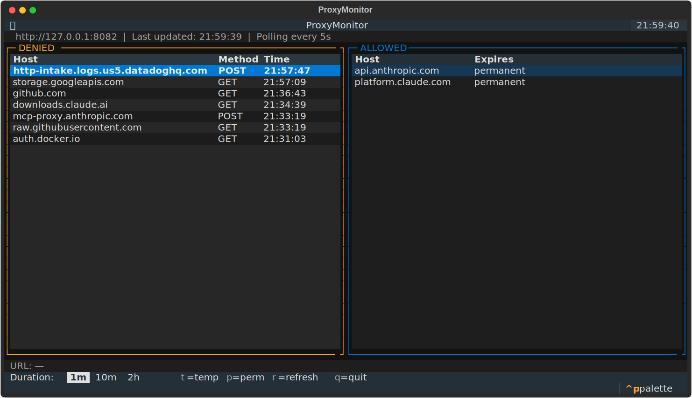

# agent-proxy

**Warning:** This is an experimental more-or-less vibe-coded project. I've had a look a the code, but haven't thoroughly vetted it.

mitmproxy addon that acts as the sole HTTP/HTTPS egress point for an LLM agent sandbox. Enforces a domain allowlist, brokers API credentials so real secrets never enter the sandbox, strips unwanted `Set-Cookie` response headers, and exposes a management API for runtime changes.

## Setup

```
uv sync
```

## Run

```bash
# headless
PROXY_CREDENTIALS='...' uv run mitmdump -s addon.py

# with web UI
PROXY_CREDENTIALS='...' uv run mitmweb -s addon.py
```

Point the agent at the proxy and install the CA cert:

```bash
export HTTP_PROXY=http://127.0.0.1:8080
export HTTPS_PROXY=http://127.0.0.1:8080
export SSL_CERT_FILE=~/.mitmproxy/mitmproxy-ca-cert.pem
```

The CA cert is generated on first run at `~/.mitmproxy/` (or the path set by `--set confdir=`).

**Lima VM:** Instead of setting the env vars manually, run `setup-lima-proxy.sh` to install the CA cert into the VM's system trust store and write the proxy env to `/etc/profile.d/proxy.sh` in one step:

```bash
./setup-lima-proxy.sh [<vm-name>] [--proxy-port <port>]
```

## Configuration

**`config.yaml`** — domain allowlist and per-host options:

```yaml
allowed_hosts:
  - host: api.anthropic.com       # all Set-Cookie headers pass through (default)
  - host: platform.claude.com
    allow_response_cookies: []    # strip all Set-Cookie headers
  - host: internal.example.com
    allow_response_cookies:
      - csrftoken                 # only csrftoken passes through; others stripped
```

When `allow_response_cookies` is absent, all `Set-Cookie` headers from that host pass through unchanged. An empty list strips everything; a non-empty list is an allowlist.

**`PROXY_CREDENTIALS`** — credential mappings (JSON array). Two modes are supported:

**Swap mode** — the agent uses a placeholder value; the proxy replaces it with the real credential before forwarding. Requests with any other non-empty value are blocked (guards against prompt injection).

```json
[
  {
    "host": "api.openai.com",
    "header": "Authorization",
    "fake_value": "Bearer sk-fake",
    "real_value": "Bearer sk-real"
  }
]
```

**Inject mode** — the proxy unconditionally sets the header, regardless of what the agent sent. Useful for cookies or other credentials the agent should never handle itself. Omit `fake_value`:

```json
[
  {
    "host": "internal.example.com",
    "header": "Cookie",
    "real_value": "session=abc123"
  }
]
```

**Environment variables:**

| Variable | Default | Description |
|---|---|---|
| `PROXY_CONFIG` | `config.yaml` | Path to allowlist YAML |
| `PROXY_CREDENTIALS` | `[]` | JSON credential mappings |
| `PROXY_MGMT_PORT` | `8082` | Management API port |

## Terminal UI

A terminal UI for monitoring and managing the proxy at runtime:

```bash
uv run python tui.py
# or with a custom port:
uv run python tui.py --port 9000
```

The port defaults to `$PROXY_MGMT_PORT` (or 8082 if unset).



The UI polls every 5 seconds and shows two panels:

- **DENIED** — recent blocked connections, deduplicated by host, newest first. The full URL of the highlighted row is shown below the panels.
- **ALLOWED** — current allowlist: permanent hosts and temporary allows with live countdown.

Key bindings:

| Key | Action |
|---|---|
| `↑` / `↓` or `k` / `j` | Navigate rows |
| `Tab` | Switch focus between panels |
| `1` / `2` / `3` | Select duration: 1m / 10m / 2h |
| `d` | Cycle through durations |
| `t` | Temporarily allow the selected denied host |
| `p` | Permanently allow the selected denied host |
| `r` | Force refresh |
| `q` | Quit |

## Management API

Runs on `127.0.0.1:8082` (not proxied).

| Method | Path | Body | Description |
|---|---|---|---|
| GET | `/allowlist` | — | Permanent + active temporary allows |
| GET | `/denied` | — | Recent denied requests |
| POST | `/allow/temp` | `{"host": "…", "duration_seconds": 60}` | Add TTL-based allow; `duration_seconds` defaults to 300 |
| POST | `/allow/permanent` | `{"host": "…"}` | Append to `config.yaml` and reload |

Reload allowlist without restart: `kill -HUP <pid>`

## Tests

```bash
uv run pytest            # unit tests
uv run pytest test_functional.py -v   # integration tests (starts real proxy)
```

## License

MIT
