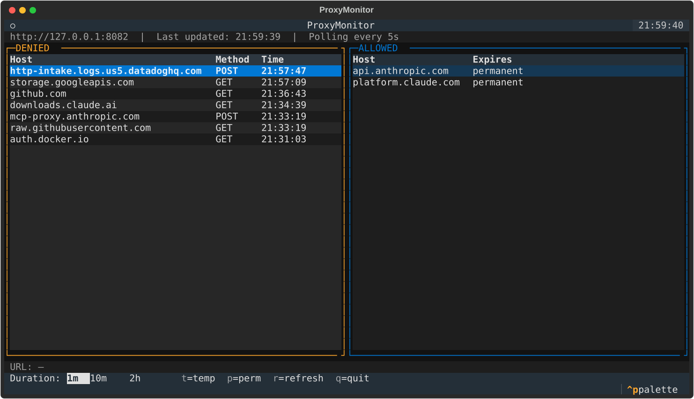

# agent-proxy

**Warning:** This is an experimental more-or-less vibe-coded project. I've had a look a the code, but haven't thoroughly vetted it.

mitmproxy addon that acts as the sole HTTP/HTTPS egress point for an LLM agent sandbox. Enforces a domain allowlist, brokers API credentials so real secrets never enter the sandbox, strips unwanted `Set-Cookie` response headers, and exposes a management API for runtime changes.

## Setup

```
uv sync
```

## Run

```bash
# headless
uv run mitmdump -s addon.py

# with web UI
uv run mitmweb -s addon.py
```

Point the agent at the proxy and install the CA cert:

```bash
export HTTP_PROXY=http://127.0.0.1:8080
export HTTPS_PROXY=http://127.0.0.1:8080
export SSL_CERT_FILE=~/.mitmproxy/mitmproxy-ca-cert.pem
```

The CA cert is generated on first run at `~/.mitmproxy/` (or the path set by `--set confdir=`).

**Lima VM:** Instead of setting the env vars manually, run `setup-lima-proxy.sh` to install the CA cert into the VM's system trust store and write the proxy env to `/etc/profile.d/proxy.sh` in one step:

```bash
./setup-lima-proxy.sh [<vm-name>] [--proxy-port <port>]
```

## Configuration

**`config.yaml`** — domain allowlist and per-host options (copy from `config.default.yaml` and customize):

```yaml
hosts:
  - host: api.anthropic.com       # all Set-Cookie headers pass through (default)
  - host: platform.claude.com
    allow_response_cookies: []    # strip all Set-Cookie headers
  - host: internal.example.com
    allow_response_cookies:
      - csrftoken                 # only csrftoken passes through; others stripped
```

When `allow_response_cookies` is absent, all `Set-Cookie` headers from that host pass through unchanged. An empty list strips everything; a non-empty list is an allowlist.

### Service presets

One `services:` entry grants a named service exactly the egress it needs:

```yaml
services:
  - go                                # registry presets: read-only restricted access
  - npm
  - service: github                   # scoped API preset: repo/org-restricted access,
    scope:                            # not blanket host access
      repos: [myorg/myrepo, myorg/other]
      orgs: [myorg-sandbox]           # every repo under this org
    write: true                       # opt in to issue/PR/comment writes
    fake_value: "ghp_…fake"           # the CLI holds the fake token, the proxy
    real_value: "${GITHUB_TOKEN}"     # swaps in the real one on the way out
  - service: gitlab
    host: gitlab.example.com          # self-hosted: the entry supplies the host
    scope:
      projects: [team/backend]
      groups: [team/sandbox]          # every project directly under this group
    fake_value: "glpat-…fake"
    real_value: "${GITLAB_TOKEN}"
```

**Registry presets** (`go`, `npm`, `docker`, `ghcr`, `pypi`, `crates`) pin exact hostnames and only permit GET/HEAD requests matching known, bounded URL patterns (package metadata, tarballs, manifests, blobs, pull-scoped auth tokens). Query strings and request headers are allowlisted; everything else is blocked with a 503 and `Retry-After: 5` — the same response shape as the pending-approval flow, since a human may grant a temporary allow moments later and the client should keep retrying — and shows up in the deny log tagged `policy_violation` (distinct from `pending_approval`, so operators can still tell the two apart).

**Scoped API presets** (`github` for github.com, `gitlab` for self-hosted instances) restrict `api.github.com`/`/api/v4/...` to the repos/orgs or projects/groups named under `scope:`, compiled into the same rule engine as registry presets — a service entry with neither `scope:` nor `unrestricted: true` fails to load. `write: true` opts in to issue/PR/comment (or MR/note) writes, bounded by size and content-type but not otherwise inspected; `unrestricted: true` is the explicit, logged opt-out back to blanket host access. Presets also know the header format the service's CLI sends (`Authorization: token …` for `gh`, `PRIVATE-TOKEN: …` for `glab`) and the fake-token shape it accepts. Keep real tokens in `secrets_file` and reference them as `${KEY}`; they never appear in config.yaml, management API responses, or logs. The token itself should also be scoped (a GitHub fine-grained PAT, a GitLab project access token) — these proxy rules constrain how a token can be *used* through the proxy, not what it's *valid* for. Set `allow_host: false` alongside `unrestricted: true` to broker the token without granting host access at all (e.g. when a hand-written `hosts:` entry already covers it).

The threat model, restriction design, and known limitations are documented in [docs/service-presets.md](docs/service-presets.md).

### Custom credentials

For services without a preset, `credentials:` entries in config.yaml configure the broker directly. Two modes are supported:

**Swap mode** — the agent uses a placeholder value; the proxy replaces it with the real credential before forwarding. Requests with any other non-empty value are blocked (guards against prompt injection).

```yaml
credentials:
  - host: api.openai.com
    header: Authorization
    fake_value: "Bearer sk-fake"
    real_value: "${OPENAI_API_KEY}"
```

**Inject mode** — the proxy unconditionally sets the header, regardless of what the agent sent. Useful for cookies or other credentials the agent should never handle itself. Omit `fake_value`:

```yaml
credentials:
  - host: internal.example.com
    header: Cookie
    real_value: "session=abc123"
```

**Environment variables:**

| Variable | Default | Description |
|---|---|---|
| `PROXY_CONFIG` | `config.yaml` | Path to config YAML (see `config.default.yaml` for example) |
| `PROXY_MGMT_PORT` | `8082` | Management API port the TUI connects to |

## Terminal UI

A terminal UI for monitoring and managing the proxy at runtime:

```bash
uv run python tui.py
# or with a custom port:
uv run python tui.py --port 9000
```

The port defaults to `$PROXY_MGMT_PORT` (or 8082 if unset).



The UI polls every 5 seconds and shows two panels:

- **DENIED** — recent blocked connections, deduplicated by host, newest first. Both kinds of denial return 503 with `Retry-After` to the client, so the **Type** column is how the TUI (not the client) tells them apart: `pending` (host not configured at all, awaiting human approval) vs. `violation` (host is configured but the request failed its registry policy). The full URL of the highlighted row — plus the violation reason, if any — is shown below the panels.
- **ALLOWED** — current allowlist: permanent hosts, temporary allows with live countdown, and restricted hosts with their preset name (dimmed). Temp- or perm-allowing a restricted host lifts its restrictions.

Key bindings:

| Key | Action |
|---|---|
| `↑` / `↓` or `k` / `j` | Navigate rows |
| `Tab` | Switch focus between panels |
| `1` / `2` / `3` | Select duration: 1m / 10m / 2h |
| `d` | Cycle through durations |
| `t` | Temporarily allow the selected denied host |
| `p` | Permanently allow the selected denied host |
| `s` | Open the services view |
| `r` | Force refresh |
| `q` | Quit |

The **services view** (`s`) manages service presets: `a` adds one (pick the service; for self-hosted services enter the host; scoped API presets prompt for each scope param — a blank answer for all of them asks for explicit confirmation before granting unrestricted access — and then for each opt-in flag; for credential services the fake token is auto-generated and the real token is entered once, masked, and stored in `secrets_file` — it is never shown again), `e` edits a scoped service's scope/flags without touching its token, `o` rotates a real token in place, `x` removes a service along with its stored secret. The table's **Scope** column shows the configured scope and flags, with `unrestricted`/unscoped flags highlighted so the blanket-access choice stays visible.

## Management API

Runs on `127.0.0.1:8082` (not proxied).

| Method | Path | Body | Description |
|---|---|---|---|
| GET | `/allowlist` | — | Permanent + active temporary allows |
| GET | `/denied` | — | Recent denied requests |
| POST | `/allow/temp` | `{"host": "…", "duration_seconds": 60}` | Add TTL-based allow; `duration_seconds` defaults to 300 |
| POST | `/allow/permanent` | `{"host": "…"}` | Append to current config file and reload |
| GET | `/services/available` | — | Service preset catalog (name, needs_token, host_param, scope_params, scope_flags, header, fake prefix) |
| GET | `/services` | — | Configured services, redacted (never real tokens) |
| POST | `/services` | `{"service": "github", "host"?: "…", "scope"?: {…}, "unrestricted"?: true, "real_value"?: "…", <flags>}` | Add a service: generates the fake token, stores the real one in `secrets_file`, writes a `${KEY}` ref to config.yaml |
| PUT | `/services` | `{"service": "…", "host"?: "…", "real_value"?: "…", "scope"?: {…}, "unrestricted"?: true, <flags>}` | Rotate the real token and/or edit scope/flags in place (at least one field required) |
| DELETE | `/services` | `{"service": "…", "host"?: "…"}` | Remove the service and its stored secret |

Real credentials are write-only: accepted on POST/PUT `/services`, persisted to `secrets_file`, and never returned by any endpoint.

Reload allowlist without restart: `kill -HUP <pid>`

## Tests

```bash
uv run pytest            # unit tests
uv run pytest test_functional.py -v   # integration tests (starts real proxy)
```

## License

MIT
